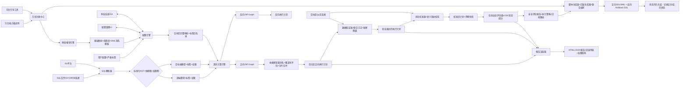

# 数据库结构比对与同步工具详细设计文档 (v4.0)

**版本迭代说明**：v4.0 合并了 v3.3（极端风险防御）与 v3.4（执行回滚与生态协同）的全部能力，形成最终完整方案。v3.4 对 v3.3 的**关键修复**包括：伪 2PC 回滚机制补全、标签静默忽略升级为环境感知阻断、AST 部分融合加白名单管控、指纹比对升级为语义指纹。**新增补齐**包括：双向 Diff 与回滚脚本自动生成、结构-数据联合订正（DML 联动）、权限与角色感知同步、Git 版本控制深度集成、外部 OSC 工具状态探针、大表熔断自动化降级闭环。v4.0 是面向企业级无人值守发布的完整基线版本。

---

## 1. 产品概述

### 1.1 产品定位
一款支持纯 SQL 脚本文件比对与在线数据库实例比对的双模引擎工具。核心解决开发/运维过程中结构版本不一致、字段重命名误判导致数据丢失、跨环境迁移脚本生成等痛点。v4.0 在 v3.2 全面覆盖"生产环境生存能力"的基础上，进一步补齐**极端风险防御**、**配置可运维性**、**执行回滚自愈**与**上下游生态协同**四大闭环，实现了从"变更前防御"到"变更后自愈"、从"单一结构比对"到"全要素 Schema 版本控制"的完整跨越。

### 1.2 核心价值（v4.0 总览）

- **通用多方言架构**：新增方言仅需编写 YAML 能力描述符，零代码接入；配置成本从 O(N²) 降为 O(N)。提供交互式引导向导，将 YAML 编写门槛从 DBA 专家级降至普通工程师可操作。

- **语义保真度量化**：每条类型映射附带语义保真度分数，报告按无损/有损/高危三级展示，让用户显式感知并承担语义损失风险。

- **统计代表性验证**：Dry-Run 采样从随机升级为分层极值采样，消除边界值与脏数据的验证盲区。**v4.0 新增超大表熔断的自动化降级闭环（从库探测/直方图估算），彻底消除人工干预断点。**

- **状态一致性校准**：断点续传增加 Reconciliation 阶段与对象指纹校验。**v4.0 引入无序集合"语义指纹"，精准区分列顺序调整与真实结构漂移，杜绝误判阻断。**

- **双向 Diff 与故障自愈（v4.0 核心新增）**：差异计算引擎同时生成正向执行图与反向回滚图。彻底解决跨分片执行中途失败后的有损分裂问题，状态机新增 `ROLLING_BACK` 状态，实现变更后自动回滚。

- **严格标签与防穿透机制（v4.0 增强）**：废弃 v3.3 的"静默忽略"策略，引入环境感知的严格模式。未注册标签在生产环境直接阻断（Fail-Fast），消除隐性有损映射风险。

- **结构-数据联合订正（v4.0 新增）**：突破纯 DDL 边界，对于已知的有损类型映射，支持绑定前置 DML 清洗脚本模板，实现结构变更与数据清洗一体化下发。

- **全要素 Schema 同步（v4.0 新增）**：标准化模型层新增 `Privilege` 节点，支持 GRANT/REVOKE 的差异比对与幂等脚本生成。

- **Git-Native 漂移检测（v4.0 新增）**：源端输入深度对接 Git，支持基于 Commit Diff 的增量 SQL 提取，精准过滤被 Revert 的废弃分支代码。

- **外部工具态感知（v4.0 增强）**：在线变更路由至 pt-osc/gh-ost 后，增加状态轮询探针，将外部工具进度无缝映射回断点续传状态机。

- **依赖感知智能重命名**：重命名推断纳入全库对象依赖图、批量命名模式识别及方言类型兼容矩阵。**v4.0 新增依赖图覆盖率评估与多层递归策略，避免"假性置信度"误导用户。**

- **在线变更安全评估**：DDL 语法正确性之上增加"运行安全"维度，拓展至危险 DDL（DROP/TRUNCATE）的强制兜底重写策略。

- **AST 安全透传（v4.0 增强）**：引入"安全融合白名单"边界管控，杜绝复杂 DDL 变更下局部文本替换导致的语法错误。

- **分布式状态持久化**：状态后端插件化 + 加密签名 + 分布式锁，支持正向执行与反向回滚的双向状态追踪。

---

## 2. 系统架构设计

### 2.1 核心模块划分

| 模块 | 职责 | v4.0 关键能力 |
| :--- | :--- | :--- |
| **方言注册中心** | 管理所有已注册方言的能力描述符 | 语义保真度属性、版本生命周期、在线安全评级、危险等级（destruction_level）、描述符自洽性校验、**回滚模板（rollback_templates）** |
| **SQL 解析器** | 将 SQL 文本/DB 元数据/Git Diff 转换为统一 AST | .dbmeta.yaml 伴随文件、混合输入、方言感知解析、**Git Diff 增量提取器**、**AST 原始文本水印保留** |
| **标准化模型层** | 消除方言差异，构建内存对象模型 | 业务标签属性、依赖关系图、Canonical 类型映射、依赖图覆盖率元数据、**Privilege（权限）对象节点**、**语义指纹算法** |
| **映射推导引擎** | 根据源/目标能力描述符自动生成基础映射 | 语义保真度计算、类型最近似匹配、语法降级、**DML 清洗模板绑定推导** |
| **配置引擎** | 五层继承链加载、校验、缓存、热重载 | 通用表达式引擎、COW 读写分离、审批流集成、**环境感知严格标签策略（阻断级）**、**Trace 环形缓冲区** |
| **差异计算引擎** | 集合运算 + 相似度匹配 + 等价过滤 | 依赖图感知重命名、批量模式识别、分片并行、资源感知调度、**正向/反向双向 Diff 生成**、**依赖图覆盖率动态修正置信度**、**权限差异计算** |
| **数据验证器** | Dry-Run 阶段采样验证类型变更安全性 | 分层极值采样、统计预检、置信区间输出、**超大表自适应熔断回退**、**结构-数据联合订正编排**、**大表从库/直方图自动降级验证** |
| **状态校准器** | 断点恢复时校验状态文件与目标库一致性 | 对象指纹比对、存在性检查、状态自动修正、**智能基线重置（Rebase）**、**漂移快照对比**、**无序集合语义指纹比对** |
| **在线安全评估器** | DDL 执行对业务影响的预判与策略路由 | 阻塞风险识别、在线变更工具路由、锁超时注入、危险 DDL 归档兜底策略、**外部 OSC 工具状态探针与进度桥接** |
| **状态持久化层** | 同步状态的存储、读取与并发控制 | 后端插件化、AES-GCM 加密、HMAC 签名、状态脱敏、**双向状态机（含 ROLLING_BACK 状态）** |
| **脚本生成器** | Diff Graph → 目标方言安全 DDL 与回滚脚本 | Jinja2 方言感知模板、自适应幂等、动态环境检查、**AST 安全透传**、**回滚脚本生成器**、**结构-数据联合编排** |
| **配置管理 UI** | 可视化编辑、预览、版本管理、审批 | 方言动态下拉、继承视图、漂移检测面板、决策链路可视化、**标签管理面板（生命周期/白名单）**、**风险矩阵展示**、**回滚预览面板**、**严格标签告警面板** |
| **报告渲染器** | 生成可视化对比结果 | 语义保真度分级、验证置信区间、状态校准日志、在线影响评估、**依赖分析覆盖率标注**、**冲突矩阵可视化**、**权限变更矩阵**、**正向/反向执行计划对比** |
| **方言引导工具** | 交互式生成方言能力描述符 | CLI 交互式问答、自动化单元测试用例生成、描述符自检修复 |

### 2.2 数据流转图



---

## 3. 核心功能详细设计

### 3.1 通用多方言适配体系

#### 3.1.1 方言能力描述符规范
每个支持的数据库独立定义 `dialect_<name>.yaml`，声明该方言固有特性，与迁移方向无关：

- **基础信息**：方言名称、支持版本列表、版本生命周期状态（推荐/兼容/废弃）
- **类型系统**：原生类型清单、存储特性、精度范围、自增机制、语义保真度基准值
- **DDL 特性**：RENAME COLUMN / ALTER TYPE / CONCURRENT INDEX / 事务 DDL / IF NOT EXISTS 等能力及对应语法模板
- **回滚模板（v4.0 新增）**：`rollback_templates` 声明每种 DDL 操作的逆向操作模板（如 ADD COLUMN → DROP COLUMN，MODIFY COLUMN → 基于变更前快照恢复）
- **在线安全评级**：每种 DDL 操作在不同版本/数据量下的 `online_safety` 属性（NON_BLOCKING / BLOCKING_SHORT / BLOCKING_LONG / REQUIRES_GHOST），以及对应的 pt-osc / gh-ost 参数模板
- **危险等级**：`destruction_level` 属性（SAFE / MODIFY / DANGEROUS / FATAL），用于危险 DDL 兜底策略
- **标识符规则**：大小写敏感性、最大长度、引用字符、保留字文件路径
- **元数据访问**：表/列/索引/约束/依赖关系的查询模板（支持版本条件分支），每个查询附带 `performance_profile`（LIGHT / MEDIUM / HEAVY）及预估耗时；依赖查询额外声明 `depth_support`（最大递归层级）
- **前置检查项**：表空间余量、权限、关键参数等检查查询及阈值
- **版本条件分支**：同一能力在不同版本下取值不同时，使用 `version_conditions` 声明

#### 3.1.2 映射推导引擎
当用户指定源/目标方言后，系统根据两份能力描述符自动推导基础映射模板：

- **类型映射推导**：源类型 → Canonical 中间类型 → 目标方言最近似类型；无匹配时按存储特性降级
- **语义保真度计算**：每条映射自动计算保真度分数（1.0=完全等价，0.8=功能子集，0.5=仅存储兼容，0.0=不兼容），写入 Diff 结果
- **语法降级推导**：目标不支持的 DDL 特性 → 查找替代方案或标记为 UNSUPPORTED
- **等价规则推导**：双方均支持的语义等价写法自动注册
- **命名转换推导**：根据目标标识符规则自动生成大小写转换、截断策略
- **事务策略推导**：根据目标 DDL 事务支持情况选择包裹方式
- **DML 清洗模板绑定推导（v4.0 新增）**：对于有损类型映射（保真度 < 0.8），自动从预置规则库中匹配适用的 `pre_transform_sql` 模板

推导结果缓存至 `plugins/mappings/base/`，首次使用时自动生成。推导模板标记为 UNVERIFIED，生产使用前强制 DBA 审核。

#### 3.1.3 方言插件化注册与引导工具
- 启动时扫描 `plugins/dialects/` 目录，动态加载能力描述符并注册到方言注册中心
- UI 配置编辑器自动识别已注册方言，下拉选项按"推荐/兼容/废弃"三级分组展示，废弃版本强制二次确认
- 支持运行时热加载新方言插件，无需重启服务
- 保留逃生通道：允许为特定组合提供完全手写的 `mapping_<srcto<tgt>.full.yaml` 跳过自动推导
- **方言引导工具（Bootstrap Wizard）**：提供 `dbdiff dialect init` 交互式 CLI，通过问答生成完整 YAML；启动时执行自洽性校验（Schema Validation），校验失败则拒绝加载并输出修复指引（详见 4.5 节）

---

### 3.2 五层配置继承体系与严格标签治理

配置加载遵循严格优先级链：

1. `dialect_source.yaml` (源方言能力)
2. `dialect_target.yaml` (目标方言能力)
3. `mapping_<sourceto<target>.base.yaml` (自动推导基础映射)
4. `mapping_<sourceto<target>.<env>.yaml` (环境特化覆盖)
5. `project_<name>_override.yaml` (项目业务标签覆盖)

- 前三层由系统自动加载，用户不可编辑
- 后两层为用户可编辑的业务配置
- 列表项按 `(source_type, target_type, tag)` 三元组唯一键匹配合并
- 标量值直接覆盖，深层对象递归合并

#### 3.2.1 通用表达式引擎
映射规则的条件字段支持跨方言属性访问，表达式上下文变量包括：`source.*`, `target.*`, `dialect_source.*`, `dialect_target.*`, `env.*`。支持操作符：`==`, `!=`, `>=`, `<=`, `CONTAINS`, `MATCHES`, `IN`, `AND`, `OR`, `NOT`。

#### 3.2.2 业务标签严格防穿透机制（v4.0 重构）
标签来源：配置文件显式声明、SQL 注释提取（`-- @tag: xxx`）、活体库扩展属性读取。

- **环境感知策略**：引入全局配置 `strict_tag_policy`，按环境生效：
  - `dev/test` 环境：`WARN`（输出警告，不阻断流程）
  - `staging/prod` 环境：**强制 `ERROR`**
- **阻断逻辑**：在 Prod 环境下，如果 SQL 源文件中解析到 `-- @tag: core_financial`，但该标签未在配置中心"标签注册表"中预先定义，**配置引擎将直接抛出 `UnregisteredTagException`，阻断比对流程**，并在报告中明确指出"文件 XXX 第 Y 行存在未注册标签，为防止隐性有损映射，请先注册或移除"。
- **命名空间与白名单**：所有标签必须在配置中心预先定义（含名称、所属团队、有效环境范围、过期时间）。SQL 注释自动提取的标签在非严格环境下仅作为"候选标签"展示于 UI。
- **标签优先级**：列级标签（`-- @tag: col:user_id`）> 表级标签（`-- @tag: table:users`）> 全局标签（`global_tags`），决策链路中明确标记覆盖来源。
- 带标签规则优先于无标签规则。
- UI 提供标签生命周期管理面板，支持批量导入、过期提醒与自动清理。

#### 3.2.3 配置决策轻量级追踪
为配置引擎增加 Trace Mode，完整记录决策路径：

- **Trace 日志结构**：对任意对象/字段的映射解析，输出完整决策链路（如：`project_override: no match → env_prod: condition=false → base_mapping: matched rule#37 (fidelity=0.8) → dialect_capability: semantic_fidelity=0.8`）
- **轻量级环形缓冲区**：Trace 数据写入固定大小的内存环形缓冲区（默认 10,000 条），采用生产者-消费者模式。仅当 UI 通过 WebSocket 主动拉取或 CLI 实时订阅时才推送；缓冲区满时覆盖最早数据，并附带 `dropped_count` 字段；关闭 Trace 或任务结束时立即释放，**不落盘**。
- **条件触发 Trace**：支持仅记录置信度 < 0.6 的映射、涉及 DANGEROUS 操作的决策、或发生配置覆盖的字段，大幅减少噪音。
- UI 决策链路可视化：继承视图中增加"为什么是这个结果"按钮，点击后以时间线形式展示决策链路。
- CLI 追踪命令：`dbdiff config-trace --table=xxx --column=yyy`，支持离线排查。
- Trace 开关默认关闭，仅在调试或 UI 请求时开启。

---

### 3.3 SQL 解析与上下文补全

#### 3.3.1 伴随元数据文件
定义 `.dbmeta.yaml` 与 SQL 文件同目录存放，解析时自动加载，包含数据库方言、版本、字符集、排序规则、sql_mode 等上下文。提供 CLI 命令 `dbdiff export-meta` 一键导出。支持 `explicit_dependencies` 字段手动补充依赖关系（如 `view_v2: [table_a, table_b]`），优先级高于自动解析结果。

#### 3.3.2 混合输入模式
允许"SQL 文件 + 活体数据库连接"组合输入，活体库元信息优先级高于 `.dbmeta.yaml`，高于内置默认值。

#### 3.3.3 Git 版本控制深度集成（v4.0 新增）
允许将 Git 仓库作为源输入端，解决"两个版本间到底改了什么"的问题：
- **源类型声明**：`source_type: git_diff`，配置参数包括 `repo_url`、`branch`、`base_commit`、`target_commit`。
- **增量提取**：工具在沙箱中执行 `git diff <base_commit> <target_commit> -- '*.sql'`，仅提取发生变更的 SQL 片段进行 AST 解析。
- **冲突过滤**：自动过滤掉在 Git 历史中被 Revert 或因合并冲突被标记的废弃代码，确保比对基线绝对纯净。

#### 3.3.4 AST 安全透传与边界管控（v4.0 增强）
- 标准化模型层对每条 DDL 保留 `original_sql_text` 字段。
- **完全透传条件**：标准化模型层比对后，该 DDL 对象的 AST 结构哈希与原始文本解析的 AST 哈希完全一致 → 直接输出原始文本，保留全部注释与格式。
- **安全融合白名单**（v4.0 新增）：为避免复杂 DDL 局部替换导致语法错误，仅以下**非破坏性、非结构性**变更允许使用"原始文本骨架 + 局部替换"模式：
  - `ADD COLUMN`（追加至末尾）
  - `ADD INDEX`（独立子句）
  - `ALTER COMMENT`（仅修改注释文本）
- **强制全量渲染**：对于表重命名（RENAME）、类型修改（MODIFY COLUMN）、删除列/索引（DROP）、主键变更等**结构性变更**，禁止使用原始文本骨架，必须强制走完整的 Jinja2 AST 全量渲染，确保语法和语义的绝对正确。变更部分添加 `-- [AUTO-GENERATED]` 标记。

---

### 3.4 差异计算引擎

#### 3.4.1 依赖图感知重命名与覆盖率评估
- 构建全库对象依赖图，查询模板来自方言能力描述符的 `metadata_queries.dependencies`
- **依赖分析覆盖率评估**：系统根据方言声明的 `depth_support` 与实际解析结果，计算覆盖率评分（0~100%）。不同覆盖率下置信度动态调整：
  - 覆盖率 ≥ 90%：置信度按原逻辑（*1.0）
  - 50% ≤ 覆盖率 < 90%：置信度 * 0.7，UI 标注"依赖分析可能不完整，建议人工复核视图/存储过程"
  - 覆盖率 < 50%：**禁用自动重命名推断**，强制降级为 `CREATE + DROP` 组合（无数据迁移），并高亮告警
- 不支持原生依赖查询的方言降级为正则文本扫描，覆盖率强制设为 ≤ 30%，报告中明确标注"依赖分析基于正则扫描，可靠性低"
- 候选重命名字段的依赖一致性校验：目标端对应字段未被相同对象引用时，在覆盖率修正后的置信度基础上再行调整
- 确认重命名时自动提示需同步修改的依赖对象

#### 3.4.2 批量命名模式识别
同一表中 ≥3 对候选重命名时触发变换规律提取，符合统一规律的配对额外加 15 分（上限 95），异常值标记为 SUSPECTED。

#### 3.4.3 方言感知类型兼容评分
重命名相似度模型中的"数据类型兼容"维度，查询双方能力描述符的类型兼容性矩阵，而非内置固定规则。

#### 3.4.4 双向 Diff 与回滚图生成（v4.0 核心新增）
为解决跨分片执行失败后的"有损分裂"问题，差异计算引擎在生成正向 Diff 的同时，自动生成反向 Diff Graph：
- **反向图构建逻辑**：针对正向图中的每个操作节点，查询方言能力描述符的 `rollback_templates` 生成逆向节点。例如：正向 `ADD COLUMN c1 int` → 反向 `DROP COLUMN c1`；正向 `MODIFY COLUMN c1 varchar(50)` → 反向 `MODIFY COLUMN c1 varchar(100)`（基于变更前快照）。
- **危险操作反向限制**：正向 `DROP TABLE` 的默认归档策略（`RENAME TO _archive`），其反向操作为 `RENAME _archive TO原表名`。
- **DAG 编排**：反向 Diff Graph 的拓扑排序与正向**完全颠倒**（后执行的先回滚），确保依赖关系的正确解除。

#### 3.4.5 分片并行比对与原子性协调（基于双向 Diff 增强）
- 按 Schema 或表名前缀哈希分片，线程池并行比对，跨分片依赖在合并阶段单独处理。单分片对象数上限可配置，超限自动二次分片。
- **跨分片原子性协调器（模拟 2PC，v4.0 增强）**：
  - **Prepare 阶段**：所有分片完成差异计算，生成正向执行计划、反向回滚计划和冲突矩阵。**此阶段不下发任何 DDL。**
  - **Commit 阶段（含熔断与回滚）**：
    - 仅当所有分片冲突矩阵为空时，统一下发正向 DDL。
    - **v4.0 增强**：如果在 Commit 阶段执行到第 N 条脚本时发生失败（如网络超时、权限不足、OSC 异常），状态机立即转入 `ROLLING_BACK` 状态，**自动提取反向 Diff Graph 中剩余的节点并发起回滚执行**。
    - 回滚完成后，状态持久化层记录 `PARTIALLY_ROLLED_BACK` 或 `FULLY_ROLLED_BACK` 终态，并输出详细的成功/失败清单。
- 冲突报告以矩阵形式展示跨分片引用关系，用户通过 UI 勾选解决方案后，系统重新计算合并 DAG，按依赖顺序编排 DDL。

#### 3.4.6 权限与角色感知同步（v4.0 新增）
- **标准化扩展**：AST 解析阶段提取 `GRANT/REVOKE` 语句，转化为标准化模型中的 `Privilege` 对象（包含 User/Role、Object、Action）。
- **差异比对**：独立计算源端与目标端的权限矩阵差异。
- **幂等生成**：结合方言特性（如 MySQL 的 `GRANT ... ON *.* TO 'user'@'%'` 自带幂等性，Postgres 的 `GRANT ... IF NOT EXISTS`），生成独立的权限同步脚本块，通常置于结构变更脚本末尾执行。

#### 3.4.7 元数据资源感知调度
防止元数据查询成为生产库的性能杀手：

- **性能画像**：方言能力描述符中每个元数据查询声明 `performance_profile`（LIGHT / MEDIUM / HEAVY）及预估耗时
- **动态策略路由**：差异计算引擎根据 `performance_profile` 和目标库当前负载指标（可选接入监控 API），自动调整查询策略：
  - HEAVY 查询自动拆分为分批小查询（按 Schema 或表名前缀分批）
  - 自动注入 LIMIT/OFFSET 分页
  - 高负载时段延迟执行，或降级为轻量模式
- **轻量模式开关**：提供 `--lightweight` 参数，禁用依赖图构建和统计预检，仅做基础结构比对，适用于生产库紧急排查
- **语句级超时**：所有元数据查询强制设置 `statement_timeout`，超时后降级处理而非阻塞整个比对流程，超时事件记录至报告

---

### 3.5 数据验证器与联合订正

Dry-Run 阶段对涉及类型变更的字段自动执行验证，彻底消除随机采样的统计代表性盲区：

#### 3.5.1 统计预检与自动化降级闭环（v4.0 增强）
采样前先执行轻量级统计查询：
- 字符串类型：MAX(LENGTH(col)), MAX(CHAR_LENGTH(col))
- 数值类型：MIN(col), MAX(col), COUNT(CASE WHEN col IS NULL THEN 1 END)
- 日期类型：MIN(col), MAX(col)
- JSON/文档类型：MAX(LENGTH(CAST(col AS CHAR)))

**超大表自动化降级链路（v4.0 新增）**：根据目标表近似行数动态决策——

| 表行数范围 | 策略 | 输出标记 |
| :--- | :--- | :--- |
| < 1000 万 | 主库完整统计预检（分层极值采样 + 全量统计） | `VERIFIED` |
| 1000 万 ~ 1 亿 | 主库轻量统计（仅读数据字典估算值，不访问实际数据） | `LIGHT_VERIFIED` |
| ≥ 1 亿（自动化降级链路） | 1. 尝试只读从库执行快速统计预检<br>2. 若无从库或从库延迟过大，自动下发 ANALYZE TABLE 后从 information_schema 读取估算极值<br>3. 若上述均失败，标记为 UNVERIFIED_LARGE_TABLE 并阻断 | `REPLICA_VERIFIED` / `HISTOGRAM_ESTIMATED` / `UNVERIFIED_LARGE_TABLE` |

报告必须明确输出降级尝试的轨迹（如：`Replica timeout → Fallback to Histogram → Success`）。所有统计信息查询结果缓存 5 分钟，报告中标注**获取时间戳**和**来源**（数据字典/实时查询/ANALYZE 结果）。

若统计结果已超限则直接标记 RISKY，无需采样。

#### 3.5.2 分层极值采样
当统计预检通过后，执行分层极值采样，确保覆盖边界值与特殊场景：
- 数值类型：MIN 值 + MAX 值 + AVG 附近值 + 随机样本
- 字符串类型：MAX_LENGTH 值 + TOP_N_DISTINCT 值 + 含特殊字符样本 + 随机样本
- 日期类型：MIN 值 + MAX 值 + 随机样本
- 空值分布：NULL 样本 + 非 NULL 样本按比例抽取

#### 3.5.3 验证项与置信区间
验证项：长度溢出、格式兼容性、空值分布变化、精度损失、特殊字符编码
报告中明确展示：采样覆盖率、极值分布、验证结论的置信区间
提供"全量验证"选项（仅限小表或低峰期），作为高风险变更的最终确认手段

#### 3.5.4 结构-数据联合订正编排（v4.0 新增）
突破纯 DDL 边界，解决"类型缩容导致数据越界"的问题：
- **DML 模板绑定**：在 `mapping_override.yaml` 中，允许为有损映射规则绑定 `pre_transform_sql`（前置清洗模板）。例如：`BIGINT → INT` 绑定 `UPDATE {{table}} SET {{column}} = NULL WHERE {{column}} > 2147483647`。
- **执行编排**：脚本生成器在输出该字段的 `ALTER TABLE ... MODIFY` 之前，先输出绑定的 DML 语句，并用事务或显式注释包裹，形成 `[数据清洗] → [结构变更]` 的原子操作序列。

---

### 3.6 状态校准器与智能基线重置

断点恢复时增加 Reconciliation 阶段，防止状态文件与目标库实际状态不一致：

#### 3.6.1 状态 Reconciliation
对每个 SUCCESS 项执行轻量级存在性检查（如 `SELECT 1 FROM information_schema.tables WHERE ...`），不一致时自动修正状态并记录校准日志。

#### 3.6.2 基于语义指纹的漂移判定（v4.0 重构）
解决 v3.3 中"调整列顺序导致哈希突变被误判为严重漂移"的缺陷：
- **双重指纹算法**：
  - `structural_hash`：包含表名、列名、列顺序、索引等全量信息的严格哈希。
  - `semantic_hash`：**将列集合、索引集合进行字母序排序后**计算的哈希（忽略物理顺序）。
- **校准逻辑**：断点恢复时，优先比对 `semantic_hash`。
  - 若 `semantic_hash` 一致，即使 `structural_hash` 不一致（如人工执行了 `MODIFY COLUMN ... FIRST`），判定为**"轻微漂移（物理属性变化）"**，自动合并漂移项，继续执行。
  - 若 `semantic_hash` 不一致，才判定为**"严重漂移（结构性变化）"**，触发阻断与 Rebase 交互流程。

#### 3.6.3 智能基线重置（Rebase）
提供 `--reconcile strategy=rebase` 模式，允许用户将目标库当前实际状态重新定义为新的执行基线：
- **轻微漂移**（仅索引/注释差异，语义指纹一致）：自动合并漂移项到状态文件，记录 `REBASED` 操作类型，继续执行后续 DDL
- **严重漂移**（语义指纹不一致）：强制阻断，生成详细"目标库漂移报告"，要求用户通过 UI 确认是**覆盖（Overwrite）**还是**跳过（Skip）**该对象
- CLI 触发：`dbdiff sync-status --reconcile strategy=rebase --auto-approve-minor`
- UI 操作：漂移报告页面提供"覆盖基线"和"跳过对象"按钮，操作记录写入审计日志

#### 3.6.4 漂移快照对比与状态完整性
- 校准日志中保存漂移前后的指纹快照（JSON Diff），支持 CLI 命令 `dbdiff fingerprint diff <state_id>` 输出结构化对比结果
- 状态文件增加 checksum，防止被意外篡改
- 提供 `dbdiff sync-status --reconcile` CLI 命令，允许运维人员在异常后手动触发状态校准
- 校准结果写入报告，供审计追溯

---

### 3.7 在线安全评估器与危险 DDL 兜底

在 DDL 语法正确性之上，增加"运行安全"维度的预判与策略路由：

#### 3.7.1 阻塞风险识别与危险等级分类
- 脚本生成前，对每条 DDL 执行在线安全评估：
  - 查询方言能力描述符的 `online_safety` 属性
  - 结合目标表行数估算（从元数据获取），判断实际阻塞风险等级
- **危险等级分类**：

| 等级 | 操作类型 | 默认策略 |
| :--- | :--- | :--- |
| **SAFE** | CREATE / RENAME（非覆盖） | 直接执行 |
| **MODIFY** | ALTER TYPE / ADD COLUMN（含默认值） | 需 Dry-Run 验证通过 |
| **DANGEROUS** | DROP COLUMN / DROP INDEX / TRUNCATE | **强制阻断**，必须人工审批 |
| **FATAL** | DROP TABLE / DROP SCHEMA | **强制重写为归档策略**，禁止原生 DROP |

#### 3.7.2 执行策略自动路由与外部态感知（v4.0 增强）
- 根据阻塞风险等级，自动选择执行策略：
  - `NON_BLOCKING` / `BLOCKING_SHORT`：直接生成原生 DDL
  - `BLOCKING_LONG` / `REQUIRES_GHOST`：自动替换为 pt-online-schema-change 或 gh-ost 调用模板，注入预定义参数
- **外部工具状态探针（v4.0 新增）**：
  - 工具不再"发射后不管"，而是启动后台探针线程。
  - 对于 **gh-ost**：探针定期查询 `{{table}}_gho` 的存在性及行数比例，或监听 gh-ost 输出的回调 URL/日志文件，识别 `copy`、`cut-over`、`postpone` 状态。
  - 对于 **pt-osc**：解析 `_new` 后缀表的创建与 Trigger 状态。
  - **状态桥接**：将外部工具的状态实时映射回本系统的状态持久化层（如标记为 `OSC_COPYING: 45%`）。如果外部工具报错退出，探针立即捕获异常，触发 3.4.5 节的**反向回滚流程**。
- **危险 DDL 兜底重写**：
  - 当判定为 DANGEROUS 或 FATAL 级别时，默认**不生成原生 DROP**，而是生成归档安全操作序列：
    1. `RENAME TABLE {old} TO _archive_{timestamp}_{old}`（或 `RENAME COLUMN` 为废弃前缀）
    2. （可选）生成归档清理提醒，由运维人员确认后手动清理
  - 用户需在配置文件中显式声明 `allow_destructive: true` 并附带审批工单号才能绕过兜底，该开关一旦开启，状态文件中永久记录审计水印
- 在脚本头部注入显式锁等待超时设置（如 `SET lock_wait_timeout = 3`）

```yaml
# project_override.yaml 配置示例
safety_policy:
  destructive_operations: "ARCHIVE"  # 可选值: ARCHIVE(默认) / APPROVE_ONLY / FORCE_ALLOW
  archive_suffix: "_retired_${timestamp}"
  force_allow_approval_id: "INC-2026-001"  # FORCE_ALLOW 时必须填写审批工单号
```

#### 3.7.3 在线影响评估报告
- 报告中新增"在线影响评估"摘要，与"语义保真度"并列展示
- 每条 DDL 标注阻塞风险等级、危险等级和预估影响时长
- 高危操作高亮展示，附在线变更工具调用参数预览或归档重写策略预览
- 明确区分"结构安全"和"运行安全"

---

### 3.8 状态持久化层

解决容器化/CI/CD 环境下的状态单点故障与安全漏洞：

#### 3.8.1 状态后端插件化
除本地文件外，支持多种状态存储后端：
- **Local File**：默认，适用于单机开发环境
- **Redis**：适用于分布式部署，支持 TTL 自动过期
- **S3 / OSS**：适用于云原生环境，支持版本控制
- **Database Table**：适用于企业级部署，支持事务和审计

通过配置文件切换后端，接口统一。

#### 3.8.2 加密与签名
- 状态内容使用 AES-GCM 加密敏感字段（如对象名、连接信息）
- HMAC-SHA256 签名防篡改，密钥从环境变量或 Vault 注入
- 读取时自动验签，签名不匹配则拒绝加载并告警

#### 3.8.3 双向状态机与并发控制（v4.0 增强）
- **状态枚举**：`PENDING` → `RUNNING` → `OSC_SYNCING` → `SUCCESS` / `FAILED` → **`ROLLING_BACK`** → `PARTIALLY_ROLLED_BACK` / `FULLY_ROLLED_BACK` / `RECOVERY_REQUIRED`
- **分布式锁增强**：多实例场景下，获取锁时不仅锁定状态文件，同时锁定目标库的"变更锁表"（如写入 `dbdiff_lock` 表），防止其他实例甚至外部脚本误操作正在回滚的对象
- 锁超时自动释放，防止死锁；锁获取失败时返回明确错误信息，提示其他实例正在执行

#### 3.8.4 状态脱敏
- 对象名哈希化存储，仅在需要展示时通过内存映射表还原
- 日志中不输出完整状态内容，仅输出哈希摘要

---

### 3.9 脚本生成器

#### 3.9.1 Jinja2 方言感知模板
DDL 生成使用方言感知的 Jinja2 模板，模板变量来自能力描述符，支持条件分支。

#### 3.9.2 自适应幂等策略
根据目标方言的 `if_not_exists` 能力和事务 DDL 支持情况自动选择幂等实现方式（IF NOT EXISTS / PL/SQL 异常捕获 / 前置存在性检查）。

#### 3.9.3 动态环境检查脚本
前置检查项从目标方言能力描述符的 `pre_execution_checks` 动态生成，任一检查失败则阻断后续 DDL 并输出修复指引。

#### 3.9.4 回滚脚本生成器（v4.0 新增）
- 接收 3.4.4 节生成的反向 Diff Graph。
- 同样经过"在线安全评估器"评估回滚操作的安全性（例如：回滚时的 ADD COLUMN 是否会因表过大而锁表？若锁表，回滚脚本中也必须调用 pt-osc）。
- 输出独立的 `_rollback_{timestamp}.sql` 文件，文件头包含清晰的回滚前提条件（如"请在正向脚本执行失败且未手动干预时执行本脚本"）。

#### 3.9.5 结构-数据联合编排（v4.0 新增）
- 对于绑定了 `pre_transform_sql` 的有损映射，脚本生成器在 `ALTER TABLE ... MODIFY` 之前先输出 DML 清洗语句。
- 使用事务包裹（方言支持时）或显式注释标记原子性边界。

#### 3.9.6 断点续传与大表分批
- 状态文件记录每条 DDL 执行状态、对象指纹、checksum，支持断点恢复和手动 SKIP
- 大表 ADD COLUMN / DATA COPY 超阈值自动切换分批模式，实时反馈进度

#### 3.9.7 AST 安全透传
参见 3.3.4 节，脚本生成器优先判断是否可透传原始文本，对结构性变更强制全量渲染。

---

### 3.10 企业级配置治理

- **审批流集成**：关键配置域变更触发审批，未审批配置标记为 DRAFT，仅测试环境生效。危险 DDL 策略变更（如开启 `allow_destructive`）强制触发三级审批。
- **漂移检测**：定时比对各环境配置哈希，不一致时推送告警
- **审计增强**：变更记录包含原因、工单号、审批人、影响预览快照
- **配置引擎性能**：COW 读写分离快照，热重载全程无锁

---

## 4. 生产级风险控制与防御设计（v4.0 完整融合）

本章整合 v3.3 与 v3.4 的全部风险控制机制，构成完整纵深防御体系。

---

### 4.1 执行分裂的自愈：双向 2PC 保障

**背景**：v3.3 的模拟 2PC 只保证"下发前无冲突"，无法应对"下发中途断电/死锁"。v4.0 通过双向 Diff 彻底解决。

- **机制**：状态机监听执行器的异常抛出。一旦捕获到非业务报错（如网络超时、进程被杀），立即中断正向队列，清空当前线程池，将反向 Diff Graph 推入"紧急回滚线程池"执行。
- **容错边界**：如果回滚过程中再次失败（极端灾难），系统将当前状态锁定为 `RECOVERY_REQUIRED`，并导出包含正向成功清单、反向失败清单、手动修复 SQL 的紧急救火文档。

---

### 4.2 标签穿透的终结：严格模式阻断

**背景**：v3.3 的 WARN 日志在海量 CI/CD 日志中被淹没，导致核心字段按默认规则有损转换。

- **机制**：v4.0 的 `strict_tag_policy: ERROR` 将配置校验左移。在解析阶段（而非映射阶段）就进行白名单比对，一旦发现非法标签直接 Fail-Fast，倒逼开发者在编码阶段就规范标签使用，将风险拦截在研发流程最早期。生产环境未注册标签直接阻断，消除隐性有损映射风险。

---

### 4.3 AST 融合边界的收敛：白名单隔离

**背景**：v3.3 的"局部子句替换"在遇到表名变更级联或复杂约束修改时，会生成无法执行的伪 SQL。

- **机制**：v4.0 引入编译器领域的"安全重构"概念，仅对满足幂等且不影响整体结构的语法树节点（ADD COLUMN、ADD INDEX、ALTER COMMENT）进行文本级替换，其余一律降级为抽象语法树全量代码生成，牺牲极小部分的"格式保留"，换取 100% 的语法正确性。

---

### 4.4 大表验证的最后一公里：无人工降级链

**背景**：v3.3 对于亿级表直接放弃验证并要求人工上传样本，在自动化流水线中属于"流程断点"。

- **机制**：v4.0 构建了 `主库 → 从库 → 统计信息字典（ANALYZE + 直方图）→ 放弃` 的三级自动降级链。通过旁路探测和内置补偿机制，在绝大多数场景下都能自动获取到近似边界值完成验证，真正实现无人值守。

---

### 4.5 依赖图覆盖率评估与多层递归策略

**背景**：视图/存储过程的多层嵌套依赖难以通过单次系统表查询完整获取。直接扣减置信度可能掩盖分析不完整的真相。

#### 4.5.1 覆盖率评分标准
- 基于方言能力描述符中 `metadata_queries.dependencies.depth_support` 声明支持的最大递归层级。
- 实际解析到的依赖边数量 / 方言查询结果中的引用总数。
- 各层级置信度修正规则见 3.4.1 节。

#### 4.5.2 显式依赖注入
用户可在 `.dbmeta.yaml` 的 `explicit_dependencies` 字段手动补充依赖关系（如 `view_v2: [table_a, table_b]`），补充的依赖关系参与指纹校验，优先级高于自动解析结果，并纳入覆盖率计算（视为已覆盖边）。

---

### 4.6 方言配置引导工具与自检

**背景**：方言能力描述符（YAML）的编写对 DBA 要求极高，`version_conditions` 与 `online_safety` 的复杂分支极易写错。

#### 4.6.1 交互式 CLI 向导
提供 `dbdiff dialect init --dialect mysql --version 8.0` 命令，通过交互式问答收集关键能力，自动生成完整 YAML 文件及单元测试用例。

#### 4.6.2 描述符版本兼容性自检
启动时方言注册中心对已加载的描述符执行**自洽性校验**（Schema Validation），校验失败则拒绝加载并输出具体缺失字段的修复指引。

---

### 4.7 轻量级 Trace 环形缓冲区

**背景**：全量持久化 Trace 日志在大规模映射场景下会导致严重的磁盘 I/O 和性能衰减。

- **缓冲区大小**：默认 10,000 条，可配置（`trace.buffer_size`）。
- **推送方式**：通过 WebSocket 或 CLI 实时订阅，推送时附带 `dropped_count` 字段。
- **条件触发**：仅记录置信度 < 0.6、涉及 DANGEROUS 操作、或发生配置覆盖的字段，减少噪音。

---

## 5. 非功能性需求

| 维度 | 要求 |
| :--- | :--- |
| **性能** | 10 万对象级比对在 5 分钟内完成（标准网络环境）；元数据查询语句级超时默认 30 秒 |
| **可用性** | 状态持久化层支持故障自动恢复；分布式锁超时自愈；**异常中断后支持全自动或半自动回滚** |
| **安全性** | 状态文件 AES-GCM 加密 + HMAC 签名；连接信息脱敏；危险 DDL 操作强制审计水印；**生产环境标签严格防穿透** |
| **可扩展性** | 方言插件热加载；状态后端插件化；**Git 平台 API 适配器插件化（支持 GitHub/GitLab 等）** |
| **可观测性** | Prometheus 指标暴露（**增加回滚触发次数、OSC 探针延迟、标签阻断次数、Trace 丢弃数**）；结构化 JSON 日志 |

---

## 6. 总结

v4.0 是 v3.2 至 v3.4 全部能力演进的**最终完整基线**。如果 v3.2 定义了"生产环境可用"，v3.3 定义了"极端场景可控"，那么 v4.0 则回答了"**走错了怎么退回来**"以及"**上下游怎么配合**"这两个企业级发布最核心的痛点。

通过引入**双向 Diff 与回滚生成**，我们填平了 DDL 不支持事务的底层鸿沟；通过**严格标签策略**和 **AST 安全白名单**，我们消灭了"聪明反被聪明误"的代码级隐患；通过**权限同步**和 **Git 集成**，我们将工具从单纯的"表结构比对器"升格为"**全要素 Schema 版本控制引擎**"；通过**外部 OSC 状态探针**，我们将外部工具的执行进度无缝纳入内部状态机闭环；通过**语义指纹**和**自动化降级链**，我们彻底消除了运维流程中的断点与误判。

v4.0 的完整能力矩阵覆盖了数据库结构变更的**全生命周期**：

| 阶段 | v4.0 能力 |
| :--- | :--- |
| **变更前** | Git Diff 增量提取、方言映射推导、语义保真度量化、严格标签校验 |
| **比对中** | 分片并行比对、依赖图感知重命名、权限差异计算、双向 Diff 生成 |
| **验证中** | 分层极值采样、统计预检 + 三级降级链、结构-数据联合订正 |
| **执行前** | 在线安全评估、危险 DDL 兜底、OSC 自动路由、动态环境检查 |
| **执行中** | 断点续传、外部工具态感知、大表分批、双向状态机 |
| **执行后** | 语义指纹漂移检测、智能基线重置、审计追溯 |
| **异常时** | 自动回滚、紧急救火文档导出、RECOVERY_REQUIRED 状态锁定 |

至此，本工具已具备在大型互联网金融、电信级核心系统中，作为底座支撑"**无人值守、黑灯工厂**"式数据库结构发布的完整能力。

**投产强制建议**：
- 生产环境强制开启 `strict_tag_policy: ERROR`
- 危险 DDL 默认 `destructive_operations: ARCHIVE`
- 启用 `auto_rollback_on_failure: true`
- Trace 模式默认关闭，按需开启
- 超大表降级链默认启用，无需人工干预